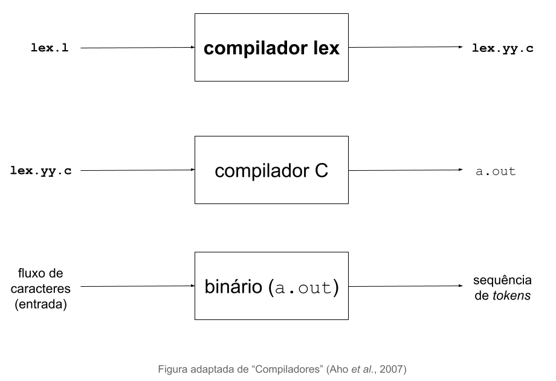

% Usando `flex`
% Adriano J. Holanda e Zhao Liang
% 2021-09-10

# Criando um analisador léxico

# Seções do arquivo

definições

%%

regras

%%

código

# Referências

- John Levine. [flex & bison](https://www.oreilly.com/library/view/flex-bison/9780596805418/). Editora O'Reilly, 2009.
- David Hanson, Christopher Fraser. [A Retargetable C Compiler: Design and Implementation](https://www.amazon.com.br/Retargetable-Compiler-Design-Implementation/dp/0805316701). Editora Addison-Wesley, 1995.
-  Alfred V. Aho, Monica S. Lam, Ravi Sethi, Jeffrey D. Ullman. [Compiladores: Princípios, Técnicas e Ferramentas](https://www.amazon.com.br/Compiladores-princ%C3%ADpios-ferramentas-Alfred-Aho/dp/8588639246). Editora Pearson, 2a edição, 2007.
